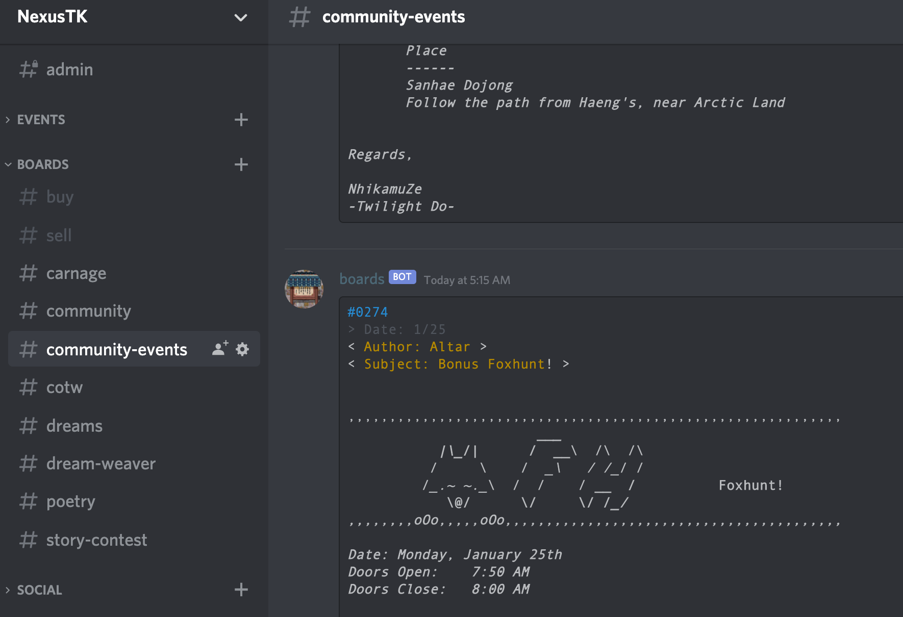

## Summary

A [Discord](https://www.discord.com) bot that scrapes posts every 15 minutes from an [online BBS](https://boards.nexustk.com) and posts them to Discord channels.

## Project Setup

1. Create discord bot through the [Discord Developer Portal](https://discord.com/developers/docs/intro) and invite the bot to your Discord server.

2. Create .env file following the .example.env format and paste your bot token from step 1.

3. Provide a valid MongoDB address to the new .env file.

4. Create discord channels (that the bot has read/write privileges to) for boards listed in the .example.env file (WHISPERING_WINDS, HUNTING, CARNAGE, etc). Copy these channel IDs into the newly created .env file.

5. Clone this repository.

6. Install dependencies with `yarn` or `npm install`.

7. `node index.js`.

## Other Bot Commands

These remote debug commands can be accessed by DMing the bot in Discord.

`!boardsforcerun all/$BOARD` - Immediately check for and post new posts.

`!setboard $BOARD $TOPPOST` - Set the top post of a board.

`!boardsstart` - Start client, Start Cron job

`!boardsstop` - Stop client, Stop Cron job

`!boardsrestart` - Stop Cron job, Destroy client, Start client, Start Cron job
